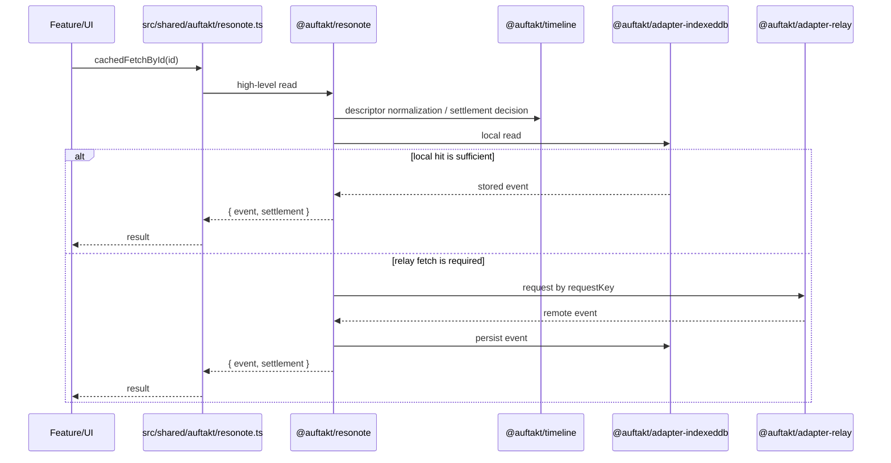
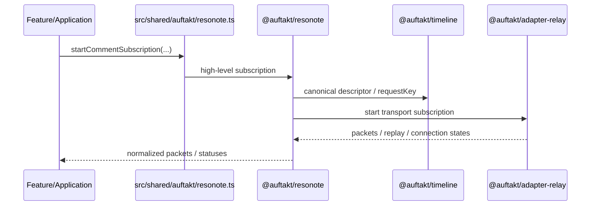
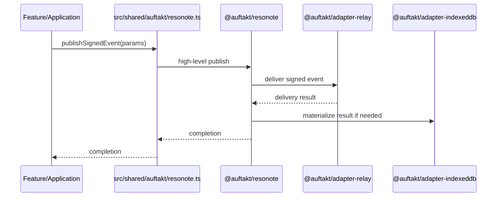

# Auftakt Specification

このドキュメントは **Auftakt の現行仕様** を定義する **正典 (Canonical Source of Truth)** である。

## 1. 境界と対象読者 (Boundary & Audience)

本ドキュメントは **app-facing** かつ **façade-centered** な仕様書であり、以下の境界を定義する。

- **対象読者**: Auftakt façade (`src/shared/auftakt/resonote.ts`) を利用して機能を実装するアプリケーション層、フィーチャー層、および共有ブラウザブリッジの開発者。
- **正典性 (Canonical Scope)**: 本ドキュメントは現行の振る舞いに関する唯一の正典である。`docs/superpowers/*` や `.sisyphus/plans/*` などの歴史的計画文書は、設計意図を理解するためのコンテキスト（コンテキストとしてのみ参照）としてのみ扱い、現在の仕様を定義するものではない。
- **非目標 (スコープ外)**: 内部ランタイム（`@auftakt/*` パッケージ群）の低レベルな実装詳細、アダプター内部のデータ構造、および将来の拡張計画の詳細は本ドキュメントの範囲外とする。これらは各パッケージ内のドキュメントやテストコードによって定義される。

## 2. 概要

Auftakt は、Resonote における Nostr runtime を多層化した内部アーキテクチャである。目的は、アプリケーション層から relay transport・永続化・再購読・整合処理の実装詳細を切り離し、安定した高レベル API を提供することにある。

Auftakt は次の原則に従う。

- アプリケーションは高レベル API のみを利用する
- 共通語彙は一箇所に集約する
- 判断と実行を分離する
- transport と persistence を adapter 層へ閉じ込める
- app-facing な入口を façade に一本化する

---

## 3. 設計方針

### 3.1 目標

1. アプリ層が Nostr の低レベル実装を意識しなくてよいこと
2. request / settlement / reconcile を共通語彙で扱えること
3. relay transport と local persistence を独立した adapter に分離すること
4. read / subscribe / relay status を高レベル API として提供すること
5. feature code の import point を façade へ集約すること

### 3.2 非目標 (スコープ外)

- UI state の所有
- feature 固有 business logic の保持
- transport packet shape の公開
- adapter 内部 API の app-facing 露出
- 内部ランタイムの実装詳細の網羅

---

## 4. 全体アーキテクチャ

```mermaid
flowchart TD
    App[Feature / Shared Browser] --> Facade[src/shared/auftakt/resonote.ts]
    Facade --> Runtime[@auftakt/resonote]
    Runtime --> Planner[@auftakt/timeline]
    Planner --> Core[@auftakt/core]
    Runtime --> Relay[@auftakt/adapter-relay]
    Runtime --> Store[@auftakt/adapter-indexeddb]
```

### 4.1 レイヤー構成

| 層                 | 役割                                                       | 主な配置                                  |
| ------------------ | ---------------------------------------------------------- | ----------------------------------------- |
| App / Feature      | 高レベル API の利用                                        | `src/features/*`, `src/shared/browser/*`  |
| App-facing façade  | import point の集約                                        | `src/shared/auftakt/resonote.ts`          |
| High-level runtime | read / subscribe / relay status / feature-facing operation | `packages/resonote/src/runtime.ts`        |
| Planner / Reducer  | request canonicalization / settlement / reconcile decision | `packages/timeline/src/index.ts`          |
| Vocabulary         | 型 / enum / 契約語彙                                       | `packages/core/src/index.ts`              |
| Relay adapter      | transport / session / replay                               | `packages/adapter-relay/src/index.ts`     |
| Storage adapter    | persistence / materialization                              | `packages/adapter-indexeddb/src/index.ts` |

---

## 5. レイヤー仕様

### 5.1 `@auftakt/core`

#### 役割

`@auftakt/core` は、runtime 全体で共有する語彙を定義する層である。

#### 主責務

- 公開型の定義
- enum の定義
- branded identifier の定義
- read / request / reconcile / relay state の契約語彙提供

#### 代表概念

- `ReadSettlement`
- `ReconcileReasonCode`
- `ConsumerVisibleState`
- `RelayConnectionState`
- `RelayObservation`
- `SessionObservation`

#### 含めないもの

- relay 実装
- storage 実装
- retry queue
- feature helper
- browser / UI 実装

---

### 5.2 `@auftakt/timeline`

#### 役割

`@auftakt/timeline` は、planner / reducer として request・settlement・reconcile を判断する層である。

#### 主責務

- request descriptor の canonicalization
- `requestKey` 生成
- read settlement の reduction
- reconcile decision / emission の生成
- stream orchestration helper の提供

#### 含めないもの

- relay socket 操作
- IndexedDB 直接操作
- UI state 推測

#### 設計原則

- 語彙は `@auftakt/core` に依存する
- 実行は adapter / runtime に任せる
- 判断だけを担う

---

### 5.3 `@auftakt/resonote`

#### 役割

`@auftakt/resonote` は、アプリケーションが必要とする高レベル runtime を提供する。

#### 主責務

- 高レベル read API
- 高レベル subscription API
- relay status exposure
- comments / notifications / profile などの feature-facing operation

#### 含めないもの

- `subId` のような transport detail の露出
- storage の materialization detail の露出
- Svelte/browser state ownership

---

### 5.4 `@auftakt/adapter-relay`

#### 役割

`@auftakt/adapter-relay` は、relay transport と session 管理を担当する。

#### 主責務

- request の transport-level 実行
- `requestKey ↔ subId` の対応管理
- reconnect / replay registry
- per-relay connection state 管理

#### 設計原則

- `subId` は transport 専用
- logical request identity は planner/runtime が決める
- app-facing には高レベル状態のみ返す

---

### 5.5 `@auftakt/adapter-indexeddb`

#### 役割

`@auftakt/adapter-indexeddb` は、イベント保存と reconcile 結果の materialization を担当する。

#### 主責務

- IndexedDB への保存
- replaceable / deletion / reconcile 結果の適用
- event persistence API の提供

#### 設計原則

- persistence に責務を限定する
- relay retry policy を持たない
- UI-visible state を持たない

---

### 5.6 `src/shared/auftakt/resonote.ts`

#### 役割

`src/shared/auftakt/resonote.ts` は、Resonote アプリが直接利用する app-facing façade である。

#### 主責務

- package runtime の高レベル API を app に公開する
- session runtime を組み立てる
- feature code の import point を一本化する

#### 設計原則

- app はこの façade を通じて Auftakt を利用する
- façade は低レベル shape を隠す
- public API は高レベル operation に限定する

---

## 6. App-facing API 一覧

`src/shared/auftakt/resonote.ts` は、アプリケーションが直接利用する入口である。

### 6.1 API サマリ

| API                              | 入力                                | 出力                               | 役割                       |
| -------------------------------- | ----------------------------------- | ---------------------------------- | -------------------------- |
| `cachedFetchById`                | `eventId: string`                   | `Promise<CachedFetchByIdResult>`   | by-id canonical read       |
| `invalidateFetchByIdCache`       | `eventId: string`                   | `void`                             | by-id cache invalidation   |
| `useCachedLatest`                | `pubkey: string, kind: number`      | `UseCachedLatestResult`            | latest-event reactive read |
| `readLatestEvent`                | `pubkey: string, kind: number`      | `Promise<Event \| null>`           | 単発 latest read           |
| `openEventsDb`                   | なし                                | `Promise<EventsDb>`                | event storage access       |
| `setPreferredRelays`             | `urls: string[]`                    | `Promise<void>`                    | preferred relay 更新       |
| `publishSignedEvent`             | `EventParameters`                   | `Promise<void>`                    | 単一 publish               |
| `publishSignedEvents`            | `EventParameters[]`                 | `Promise<void>`                    | 複数 publish               |
| `retryQueuedPublishes`           | なし                                | `Promise<void>`                    | pending publish retry      |
| `verifySignedEvent`              | `unknown`                           | `Promise<boolean>`                 | signature verification     |
| `fetchProfileMetadataEvents`     | `pubkeys: readonly string[]`        | `Promise<...>`                     | kind:0 metadata fetch      |
| `fetchFollowListSnapshot`        | `pubkey, followKind?`               | `Promise<...>`                     | follow list snapshot       |
| `fetchCustomEmojiSources`        | `pubkey`                            | `Promise<...>`                     | emoji source fetch         |
| `fetchCustomEmojiCategories`     | `pubkey`                            | `Promise<EmojiCategory[]>`         | emoji categories fetch     |
| `fetchProfileCommentEvents`      | `pubkey, until?, limit?`            | `Promise<...>`                     | profile comment read       |
| `fetchNostrEventById`            | `eventId, relayHints`               | `Promise<T \| null>`               | relay-hinted event fetch   |
| `loadCommentSubscriptionDeps`    | なし                                | `Promise<CommentSubscriptionRefs>` | comments subscription deps |
| `buildCommentContentFilters`     | `idValue, kinds`                    | `Filter[]`                         | comments filter build      |
| `startCommentSubscription`       | refs + filters + handlers           | `SubscriptionHandle`               | comments stream            |
| `startMergedCommentSubscription` | refs + filters + handlers           | `SubscriptionHandle`               | merged comments stream     |
| `startCommentDeletionReconcile`  | refs + cachedIds + handlers         | `SubscriptionHandle`               | deletion reconcile         |
| `subscribeNotificationStreams`   | options + handlers                  | `Promise<...>`                     | notification streams       |
| `snapshotRelayStatuses`          | `urls`                              | `Promise<...>`                     | relay status snapshot      |
| `observeRelayStatuses`           | `onPacket`                          | `Promise<...>`                     | relay status observe       |
| `fetchRelayListEvents`           | `pubkey, relayListKind, followKind` | `Promise<...>`                     | relay list fetch           |
| `fetchWot`                       | `pubkey + callbacks + extractor`    | `Promise<WotResult>`               | Web of Trust fetch         |
| `searchBookmarkDTagEvent`        | `pubkey, normalizedUrl`             | `Promise<...>`                     | bookmark search            |
| `searchEpisodeBookmarkByGuid`    | `pubkey, guid`                      | `Promise<...>`                     | episode bookmark search    |

### 6.2 Read API

#### `cachedFetchById(eventId: string): Promise<CachedFetchByIdResult>`

指定イベント ID に対する canonical read API。

**責務**

- local-first read
- 必要時の relay fetch
- `ReadSettlement` を含む結果返却

**返却の意味**

- `event`: 取得できたイベント、または `null`
- `settlement`: 取得過程の canonical 説明

---

#### `useCachedLatest(pubkey: string, kind: number): UseCachedLatestResult`

replaceable / latest-event 系の監視用 read API。

**責務**

- 最新イベントの追跡
- local-first + relay-aware な更新
- canonical settlement を伴う状態提供

---

#### `readLatestEvent(pubkey: string, kind: number)`

単発の最新イベント読み出し API。

---

#### `openEventsDb()`

event persistence への access point。

---

### 6.3 Publish / Relay API

#### `publishSignedEvent(params: EventParameters): Promise<void>`

署名済みイベントを publish する高レベル API。

#### `publishSignedEvents(params: EventParameters[]): Promise<void>`

複数イベント publish API。

#### `retryQueuedPublishes(): Promise<void>`

pending publish の再送 API。

#### `setPreferredRelays(urls: string[]): Promise<void>`

既定 relay 設定を更新する API。

---

### 6.4 Profile / Metadata API

#### `fetchProfileMetadataEvents(pubkeys: readonly string[], batchSize?: number)`

kind:0 metadata を取得する高レベル API。

#### `fetchFollowListSnapshot(pubkey: string, followKind?: number)`

follow list snapshot を返す API。

#### `fetchCustomEmojiSources(pubkey: string)`

custom emoji source を返す API。

#### `fetchCustomEmojiCategories(pubkey: string): Promise<EmojiCategory[]>`

custom emoji category を返す API。

---

### 6.5 Comments / Notifications API

#### `loadCommentSubscriptionDeps(): Promise<CommentSubscriptionRefs>`

comment subscription に必要な依存束を生成する。

#### `buildCommentContentFilters(idValue: string, kinds: CommentFilterKinds)`

comment content 用 filter を構築する。

#### `startCommentSubscription(...)`

comment stream を開始する。

#### `startMergedCommentSubscription(...)`

複数 comment stream を merge して開始する。

#### `startCommentDeletionReconcile(...)`

comment deletion の reconcile を開始する。

#### `subscribeNotificationStreams(...)`

notification stream 群を購読する。

---

### 6.6 Bookmark / Search API

#### `searchBookmarkDTagEvent(pubkey: string, normalizedUrl: string)`

bookmark D tag ベース検索 API。

#### `searchEpisodeBookmarkByGuid(pubkey: string, guid: string)`

episode bookmark の GUID ベース検索 API。

---

## 7. 使用例

### 7.1 by-id read

```ts
import { cachedFetchById } from '$shared/auftakt/resonote.js';

const result = await cachedFetchById(eventId);

if (result.event) {
  console.log(result.event.id);
  console.log(result.settlement.reason);
}
```

### 7.2 latest-event read

```ts
import { useCachedLatest } from '$shared/auftakt/resonote.js';

const latest = useCachedLatest(pubkey, 0);

// 例: latest.event / latest.settlement を UI で利用
```

### 7.3 profile metadata fetch

```ts
import { fetchProfileMetadataEvents } from '$shared/auftakt/resonote.js';

const events = await fetchProfileMetadataEvents([pubkeyA, pubkeyB]);
```

### 7.4 notification subscription

```ts
import { subscribeNotificationStreams } from '$shared/auftakt/resonote.js';

const handle = await subscribeNotificationStreams(options, {
  onNotification(packet) {
    console.log(packet);
  },
  onError(error) {
    console.error(error);
  }
});

// 必要に応じて handle を使って終了
```

### 7.5 publish

```ts
import { publishSignedEvent } from '$shared/auftakt/resonote.js';

await publishSignedEvent(eventParameters);
```

---

## 8. 主要データフロー

### 8.1 Read フロー



### 8.2 Subscription フロー



### 8.3 Publish フロー



---

## 9. request / replay モデル

### 9.1 requestKey

`requestKey` は logical request identity である。

#### 性質

- canonical descriptor から生成される
- transport-level ID とは独立する
- reconnect / replay 復元の基準となる

#### 目的

- 同一論理 request を stable に識別する
- replay registry を transport detail から分離する

### 9.2 `subId`

`subId` は relay transport 専用の識別子である。

#### 性質

- adapter-relay に閉じ込める
- app-facing API へ露出しない
- reconnect / replay の基準には使わない

---

## 10. settlement / reconcile モデル

### 10.1 ReadSettlement

read API は `ReadSettlement` を返す。

#### 目的

- local hit / relay fetch / miss を canonical に表現する
- ttl / invalidation / settled miss を明示する
- app に一貫した read contract を与える

#### 利用方針

- app は ad-hoc flag ではなく settlement を読む
- read の provenance / reason は settlement で判断する

### 10.2 Reconcile

reconcile は、イベント競合や state transition を canonical reason/state で表現する。

#### 代表例

- replaceable winner / loser
- deletion / tombstone
- offline confirm / reject
- replay repair

---

## 11. app-facing 利用規約

### 11.1 推奨 import

```ts
import {
  cachedFetchById,
  useCachedLatest,
  publishSignedEvent,
  fetchProfileMetadataEvents
} from '$shared/auftakt/resonote.js';
```

### 11.2 利用原則

- feature code は façade を通じて Auftakt を使う
- package internals を deep import しない
- adapter package を app から直接利用しない
- app-facing surface は `src/shared/auftakt/resonote.ts` を正とする

---

## 12. 依存方向

```mermaid
flowchart LR
    Core[@auftakt/core]
    Timeline[@auftakt/timeline]
    Resonote[@auftakt/resonote]
    Relay[@auftakt/adapter-relay]
    IndexedDB[@auftakt/adapter-indexeddb]
    Facade[src/shared/auftakt/resonote.ts]
    App[Feature / Shared Browser]

    Timeline --> Core
    Resonote --> Core
    Resonote --> Timeline
    Resonote --> Relay
    Resonote --> IndexedDB
    Facade --> Resonote
    Facade --> Relay
    App --> Facade
```

### 依存規則

- 上位レイヤーは下位レイヤーを使う
- adapter は feature を知らない
- façade は app の玄関であり、低レベル shape を隠す

---

## 13. 導入・利用ルール

### 13.1 feature からの利用原則

- read / publish / subscribe は façade を経由する
- relay transport / replay / storage へは直接触れない
- 共有語彙が必要なときだけ `@auftakt/core` を参照する

### 13.2 package 境界原則

- `core` は語彙のみ
- `timeline` は判断のみ
- `resonote` は高レベル runtime
- adapter は transport / persistence のみ

### 13.3 境界スコープ・クロスウォーク (Bounded Scope Crosswalk)

Auftakt façade には直接含まれないが、アプリケーションの動作に不可欠な「コードのみの公開レイヤー」および「ランタイム隣接面」を以下に定義する。これらは façade API を補完するコンパニオンとして機能し、適切なテストアンカーによって保護される。

| サーフェス名                                                     | 存在理由                                                                              | 依存 façade / Public API                                                | 分類                         | テストアンカー                                                        |
| :--------------------------------------------------------------- | :------------------------------------------------------------------------------------ | :---------------------------------------------------------------------- | :--------------------------- | :-------------------------------------------------------------------- |
| `src/shared/browser/relays.svelte.ts`                            | リレーステータスおよび接続状態のリアクティブな管理。                                  | `snapshotRelayStatuses`, `observeRelayStatuses`, `fetchRelayListEvents` | `companion/runtime-adjacent` | `src/shared/browser/relays.test.ts`                                   |
| `src/app/bootstrap/init-app.ts`                                  | アプリレベルの初期化オーケストレーション（Auth, 拡張機能, オフラインキュー再試行）。  | `retryQueuedPublishes`                                                  | `companion/runtime-adjacent` | `src/app/bootstrap/init-app.test.ts`                                  |
| `src/features/content-resolution/application/resolve-content.ts` | ポッドキャスト/オーディオのコンテンツ解決オーケストレーター（Nostr + API 並列解決）。 | `publishSignedEvents`                                                   | `companion/runtime-adjacent` | `src/features/content-resolution/application/resolve-content.test.ts` |
| `src/features/content-resolution/application/resolve-feed.ts`    | ポッドキャストフィードの解決およびエピソードメタデータの読み込み。                    | `publishSignedEvents`                                                   | `companion/runtime-adjacent` | `src/features/content-resolution/application/resolve-feed.test.ts`    |

---

## 14. 実装状況とギャップ (Implementation Status & Gaps)

このセクションでは、Auftakt の主要コンポーネントの実装状況と、将来的な目標状態とのギャップを concrete anchor で管理する。

| 項目                           | ステータス    | 現状アンカー (Current repo reality anchor)                                                            | 既知のギャップ (Known gap)                                                                                 |
| :----------------------------- | :------------ | :---------------------------------------------------------------------------------------------------- | :--------------------------------------------------------------------------------------------------------- |
| **App-facing façade**          | `implemented` | `src/shared/auftakt/resonote.ts`                                                                      | 主要な consumer の移行完了。旧来の内部 import は排除済み。(Proof: `check:auftakt-migration`)               |
| **ReadSettlement**             | `partial`     | `packages/core/src/index.ts` / `src/shared/auftakt/resonote.ts`                                       | 主要な consumer での導入完了。ad-hoc フラグへの直接依存は解消。(Proof: `read-settlement.contract.test.ts`) |
| **Relay lifecycle / recovery** | `implemented` | `packages/core/src/index.ts` / `src/shared/auftakt/resonote.ts` (`observeRelayStatuses`)              | 複雑なネットワーク分断シナリオにおける回復シーケンスの網羅性。(Proof: `relays.test.ts`)                    |
| **tombstone / deletion**       | `implemented` | `packages/core/src/index.ts` (`tombstoned`) / `src/features/comments/ui/comment-view-model.svelte.ts` | 長期オフライン復帰時における大規模な削除イベント同期の整合性検証。(Proof: `reply-thread.test.ts`)          |
| **negentropy**                 | `[未実装]`    | `packages/core/src/index.ts` (語彙予約のみ)                                                           | **スコープ外**。Façade および Runtime に公開アンカーが存在しない。                                         |
| **publish / session**          | `implemented` | `src/shared/auftakt/resonote.ts` (`publishSignedEvent`, `retryQueuedPublishes`)                       | 長期オフライン時のキュー溢れ制御および詳細なエラー報告機能の不足。(Proof: `resolve-content.test.ts`)       |

キーワード追跡: `ReadSettlement`, `relay lifecycle`, `recovery`, `tombstone`, `negentropy`, `publish`, `session`

---

## 15. 回帰面と検証 (Regression & Verification)

Auftakt の変更がアプリケーションに与える影響を検証するため、回帰面ごとに consumer anchor と verification anchor を固定する。

### 15.1 主要な回帰面と検証アンカー (Regression Surfaces & Verification Anchors)

| 回帰面                 | consumer / 実装アンカー                                                | 検証アンカー (Unit/Contract)                                          | 検証アンカー (E2E)                                                                 |
| :--------------------- | :--------------------------------------------------------------------- | :-------------------------------------------------------------------- | :--------------------------------------------------------------------------------- |
| **Comments**           | `src/features/comments/ui/comment-view-model.svelte.ts`                | `src/features/comments/ui/comment-view-model.test.ts`                 | `e2e/reply-thread.test.ts` (orphan/deleted), `e2e/comment-flow.test.ts` (baseline) |
| **Notifications**      | `src/features/notifications/ui/notification-feed-view-model.svelte.ts` | `src/features/notifications/ui/notification-feed-view-model.test.ts`  | `e2e/notifications-page.test.ts`                                                   |
| **Profiles**           | `src/shared/auftakt/resonote.ts`                                       | `src/features/profiles/application/profile-queries.test.ts`           | `e2e/profile-data.test.ts`                                                         |
| **Relay Settings**     | `src/features/relays/ui/relay-settings-view-model.svelte.ts`           | `src/features/relays/ui/relay-settings-view-model.test.ts`            | `e2e/relay-settings-data.test.ts`                                                  |
| **NIP-19 Resolver**    | `src/shared/auftakt/resonote.ts`                                       | `src/features/nip19-resolver/application/fetch-event.test.ts`         | `e2e/nip19-routes.test.ts`                                                         |
| **Content Resolution** | `src/shared/auftakt/resonote.ts`                                       | `src/features/content-resolution/application/resolve-content.test.ts` | `e2e/content-page.test.ts`                                                         |
| **Runtime Core**       | `packages/core/src/index.ts`                                           | `packages/core/src/read-settlement.contract.test.ts`                  | -                                                                                  |
| **Cached Query**       | `src/shared/nostr/cached-query.svelte.ts`                              | `src/shared/nostr/cached-query.test.ts`                               | -                                                                                  |
| **Relay Lifecycle**    | `src/shared/browser/relays.svelte.ts`                                  | `src/shared/browser/relays.test.ts`                                   | -                                                                                  |

### 15.2 最小検証マトリクス (Smallest-Viable Regression Matrix)

Auftakt の変更時は、広範なテストの前に以下の最小セットを実行して基本品質を担保する。

1. **Migration proof gate（authoritative）**
   - `pnpm run check:auftakt-migration -- --proof`

2. **Unit / Contract gate**
   - `pnpm run test -- packages/core/src/read-settlement.contract.test.ts src/shared/nostr/cached-query.test.ts src/features/comments/ui/comment-view-model.test.ts src/features/notifications/ui/notification-feed-view-model.test.ts src/features/relays/ui/relay-settings-view-model.test.ts src/features/profiles/application/profile-queries.test.ts src/features/nip19-resolver/application/fetch-event.test.ts src/features/content-resolution/application/resolve-content.test.ts src/shared/browser/relays.test.ts`

3. **User-visible flow gate (E2E)**
   - `pnpm run test:e2e -- e2e/reply-thread.test.ts e2e/comment-flow.test.ts e2e/profile-data.test.ts e2e/notifications-page.test.ts e2e/relay-settings-data.test.ts e2e/nip19-routes.test.ts e2e/content-page.test.ts`

### 15.3 完了判定 (Completion Criteria)

Auftakt の品質は、実装の有無だけでなく、以下で判定する。

- public API が高レベルに保たれているか
- contract tests が通るか
- app / shared regression が通るか
- user-visible flow が E2E で維持されるか
- façade が安定した import point になっているか

---

## 16. 要約

Auftakt は、Resonote における Nostr runtime を次の責務に分離した内部アーキテクチャである。

- `core` = 語彙
- `timeline` = 判断
- `resonote` = 高レベル機能
- `adapter-relay` = 通信
- `adapter-indexeddb` = 保存
- `src/shared/auftakt/resonote.ts` = app-facing façade

この構造により、アプリケーション層は relay transport や storage detail を直接扱わずに、高レベル API を通じて安定的に機能を利用できる。
