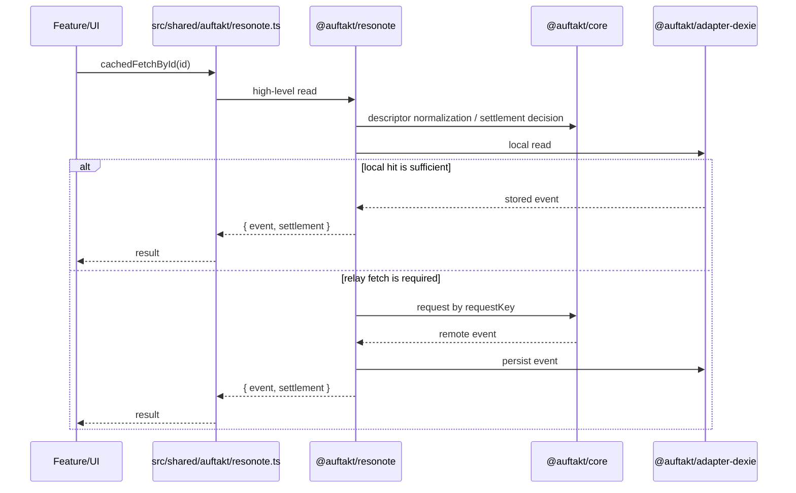
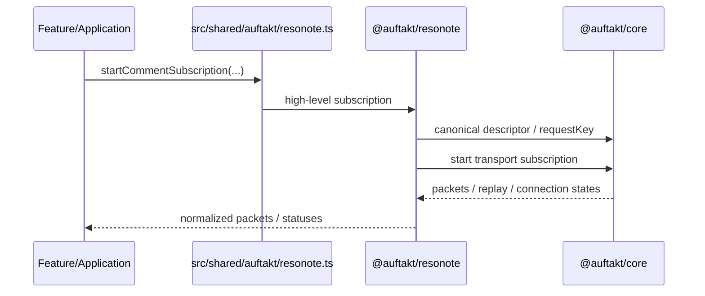
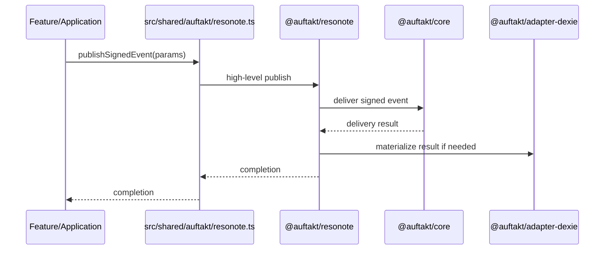

# Auftakt Specification

このドキュメントは **Auftakt の現行仕様** を定義する **正典 (Canonical Source of
Truth)** である。

## 1. 境界と対象読者 (Boundary & Audience)

本ドキュメントは **app-facing** かつ **façade-centered**
な仕様書であり、以下の境界を定義する。

- **対象読者**: Auftakt façade (`src/shared/auftakt/resonote.ts`)
  を利用して機能を実装するアプリケーション層、フィーチャー層、および共有ブラウザブリッジの開発者。
- **正典性 (Canonical Scope)**:
  本ドキュメントは現行の振る舞いに関する唯一の正典である。`docs/superpowers/*`
  や `.sisyphus/plans/*`
  などの歴史的計画文書は、設計意図を理解するためのコンテキスト（コンテキストとしてのみ参照）としてのみ扱い、現在の仕様を定義するものではない。
- **非目標 (スコープ外)**: 内部ランタイム（`@auftakt/*`
  パッケージ群）の低レベルな実装詳細、アダプター内部のデータ構造、および将来の拡張計画の詳細は本ドキュメントの範囲外とする。これらは各パッケージ内のドキュメントやテストコードによって定義される。

## 2. 概要

Auftakt は、Resonote における Nostr runtime
を多層化した内部アーキテクチャである。目的は、アプリケーション層から relay
transport・永続化・再購読・整合処理の実装詳細を切り離し、安定した高レベル API
を提供することにある。

Auftakt は次の原則に従う。

- アプリケーションは高レベル API のみを利用する
- 共通語彙は一箇所に集約する
- 汎用 runtime primitive と Resonote 固有 runtime を分離する
- persistence を backend adapter 層へ閉じ込める
- app-facing な入口を façade に一本化する

---

## 3. 設計方針

### 3.1 目標

1. アプリ層が Nostr の低レベル実装を意識しなくてよいこと
2. request / settlement / reconcile を共通語彙で扱えること
3. relay session primitive と local persistence を異なる責務として分離すること
4. read / subscribe / relay status を高レベル API として提供すること
5. feature code の import point を façade へ集約すること

### 3.2 非目標 (スコープ外)

- UI state の所有
- feature 固有 business logic の保持
- transport packet shape の公開
- adapter 内部 API の app-facing 露出
- 内部ランタイムの実装詳細の網羅

---

## 4. 全体アーキテクチャ

```mermaid
flowchart TD
    App[Feature / Shared Browser] --> Facade[src/shared/auftakt/resonote.ts]
    Facade --> Runtime[@auftakt/resonote]
    Runtime --> Core[@auftakt/core]
    Runtime --> Store[@auftakt/adapter-dexie]
    Store --> Core
```

### 4.1 レイヤー構成

| 層                | 役割                                                                   | 主な配置                                 |
| ----------------- | ---------------------------------------------------------------------- | ---------------------------------------- |
| App / Feature     | 高レベル API の利用                                                    | `src/features/*`, `src/shared/browser/*` |
| App-facing façade | import point の集約                                                    | `src/shared/auftakt/resonote.ts`         |
| Resonote runtime  | read / subscribe / relay status / feature-facing operation             | `packages/resonote/src/runtime.ts`       |
| Core runtime      | vocabulary / request planning / settlement / reconcile / relay session | `packages/core/src/*`                    |
| Storage adapter   | persistence / materialization                                          | `packages/adapter-dexie/src/index.ts`    |

---

## 5. レイヤー仕様

### 5.1 `@auftakt/core`

#### 役割

`@auftakt/core` は、runtime 全体で共有する語彙と汎用 runtime primitive
を定義する層である。

#### 主責務

- 公開型 / enum / branded identifier の定義
- read / request / reconcile / relay state の契約語彙提供
- request descriptor の canonicalization
- `requestKey` 生成
- read settlement の reduction
- reconcile decision / emission の生成
- relay request / session primitive の提供
- reconnect / replay registry
- per-relay connection state 管理

#### 代表概念

- `ReadSettlement`
- `ReconcileReasonCode`
- `ConsumerVisibleState`
- `RelayConnectionState`
- `RelayObservation`
- `SessionObservation`
- `requestKey`
- relay session primitive

#### 含めないもの

- storage 実装
- Resonote feature flow
- feature helper
- browser / UI 実装

---

### 5.2 `@auftakt/resonote`

#### 役割

`@auftakt/resonote` は、アプリケーションが必要とする高レベル runtime
を提供する。

#### 主責務

- 高レベル read API
- 高レベル subscription API
- relay status exposure
- comments / notifications / profile などの feature-facing operation

#### 含めないもの

- `subId` のような transport detail の露出
- storage の materialization detail の露出
- Svelte/browser state ownership

---

### 5.3 `@auftakt/adapter-dexie`

#### 役割

`@auftakt/adapter-dexie` は、イベント保存と reconcile 結果の materialization
を担当する。

#### 主責務

- IndexedDB への保存
- replaceable / deletion / reconcile 結果の適用
- event persistence API の提供

#### 設計原則

- persistence に責務を限定する
- relay retry policy を持たない
- UI-visible state を持たない

---

### 5.4 `src/shared/auftakt/resonote.ts`

#### 役割

`src/shared/auftakt/resonote.ts` は、Resonote アプリが直接利用する app-facing
façade である。

#### 主責務

- package runtime の高レベル API を app に公開する
- session runtime を組み立てる
- feature code の import point を一本化する

#### 設計原則

- app はこの façade を通じて Auftakt を利用する
- façade は低レベル shape を隠す
- public API は高レベル operation に限定する

---

## 6. App-facing API 一覧

`src/shared/auftakt/resonote.ts` は、アプリケーションが直接利用する入口である。

### 6.1 API サマリ

| API                              | 入力                                | 出力                                 | 役割                       |
| -------------------------------- | ----------------------------------- | ------------------------------------ | -------------------------- |
| `cachedFetchById`                | `eventId: string`                   | `Promise<CachedFetchByIdResult>`     | by-id canonical read       |
| `invalidateFetchByIdCache`       | `eventId: string`                   | `void`                               | by-id cache invalidation   |
| `useCachedLatest`                | `pubkey: string, kind: number`      | `UseCachedLatestResult`              | latest-event reactive read |
| `readLatestEvent`                | `pubkey: string, kind: number`      | `Promise<Event \| null>`             | 単発 latest read           |
| `setPreferredRelays`             | `urls: string[]`                    | `Promise<void>`                      | preferred relay 更新       |
| `publishSignedEvent`             | `EventParameters`                   | `Promise<void>`                      | 単一 publish               |
| `publishSignedEvents`            | `EventParameters[]`                 | `Promise<void>`                      | 複数 publish               |
| `retryQueuedPublishes`           | なし                                | `Promise<void>`                      | pending publish retry      |
| `verifySignedEvent`              | `unknown`                           | `Promise<boolean>`                   | signature verification     |
| `fetchProfileMetadataEvents`     | `pubkeys: readonly string[]`        | `Promise<...>`                       | kind:0 metadata fetch      |
| `fetchFollowListSnapshot`        | `pubkey, followKind?`               | `Promise<...>`                       | follow list snapshot       |
| `fetchCustomEmojiSources`        | `pubkey`                            | `Promise<...>`                       | emoji source fetch         |
| `fetchCustomEmojiCategories`     | `pubkey`                            | `Promise<EmojiCategory[]>`           | emoji categories fetch     |
| `fetchProfileCommentEvents`      | `pubkey, until?, limit?`            | `Promise<...>`                       | profile comment read       |
| `fetchNostrEventById`            | `eventId, relayHints`               | `Promise<T \| null>`                 | relay-hinted event fetch   |
| `fetchBackwardEvents`            | `filters, options?`                 | `Promise<T[]>`                       | coordinator backward read  |
| `fetchBackwardFirst`             | `filters, options?`                 | `Promise<T \| null>`                 | first backward read        |
| `loadCommentSubscriptionDeps`    | なし                                | `Promise<CommentSubscriptionRefs>`   | comments subscription deps |
| `buildCommentContentFilters`     | `idValue, kinds`                    | `Filter[]`                           | comments filter build      |
| `startCommentSubscription`       | refs + filters + handlers           | `SubscriptionHandle`                 | comments stream            |
| `startMergedCommentSubscription` | refs + filters + handlers           | `SubscriptionHandle`                 | merged comments stream     |
| `startCommentDeletionReconcile`  | refs + cachedIds + handlers         | `SubscriptionHandle`                 | deletion reconcile         |
| `subscribeNotificationStreams`   | options + handlers                  | `Promise<...>`                       | notification streams       |
| `snapshotRelayStatuses`          | `urls`                              | `Promise<...>`                       | relay status snapshot      |
| `observeRelayStatuses`           | `onPacket`                          | `Promise<...>`                       | relay status observe       |
| `snapshotRelayCapabilities`      | `urls`                              | `Promise<RelayCapabilitySnapshot[]>` | relay capability snapshot  |
| `observeRelayCapabilities`       | `onPacket`                          | `Promise<...>`                       | relay capability observe   |
| `snapshotRelayMetrics`           | なし                                | `Promise<RelayMetricSnapshot[]>`     | NIP-66 relay metrics       |
| `fetchRelayListEvents`           | `pubkey, relayListKind, followKind` | `Promise<...>`                       | relay list fetch           |
| `fetchWot`                       | `pubkey + callbacks + extractor`    | `Promise<WotResult>`                 | Web of Trust fetch         |
| `searchBookmarkDTagEvent`        | `pubkey, normalizedUrl`             | `Promise<...>`                       | bookmark search            |
| `searchEpisodeBookmarkByGuid`    | `pubkey, guid`                      | `Promise<...>`                       | episode bookmark search    |

### 6.2 Read API

#### `cachedFetchById(eventId: string): Promise<CachedFetchByIdResult>`

指定イベント ID に対する canonical read API。

**責務**

- local-first read
- 必要時の relay fetch
- `ReadSettlement` を含む結果返却

**返却の意味**

- `event`: 取得できたイベント、または `null`
- `settlement`: 取得過程の canonical 説明

---

#### `useCachedLatest(pubkey: string, kind: number): UseCachedLatestResult`

replaceable / latest-event 系の監視用 read API。

**責務**

- 最新イベントの追跡
- local-first + relay-aware な更新
- canonical settlement を伴う状態提供

---

#### `readLatestEvent(pubkey: string, kind: number)`

単発の最新イベント読み出し API。

#### `fetchBackwardEvents(filters, options?): Promise<T[]>`

互換 bridge と上位 read model 用の汎用 backward read API。relay から得た候補は
coordinator-owned ingress/materialization を経由してから結果として返す。

#### `fetchBackwardFirst(filters, options?): Promise<T | null>`

`fetchBackwardEvents()` と同じ coordinator-mediated read
経路で最初の結果だけを返す。

---

### 6.3 Publish / Relay API

#### `publishSignedEvent(params: EventParameters): Promise<void>`

署名済みイベントを publish する高レベル API。

#### `publishSignedEvents(params: EventParameters[]): Promise<void>`

複数イベント publish API。

#### `retryQueuedPublishes(): Promise<void>`

pending publish の再送 API。

#### `setPreferredRelays(urls: string[]): Promise<void>`

既定 relay 設定を更新する API。

---

### 6.4 Profile / Metadata API

#### `fetchProfileMetadataEvents(pubkeys: readonly string[], batchSize?: number)`

kind:0 metadata を取得する高レベル API。

#### `fetchFollowListSnapshot(pubkey: string, followKind?: number)`

follow list snapshot を返す API。

#### `fetchCustomEmojiSources(pubkey: string)`

custom emoji source を返す API。

#### `fetchCustomEmojiCategories(pubkey: string): Promise<EmojiCategory[]>`

custom emoji category を返す API。

---

### 6.5 Comments / Notifications API

#### `loadCommentSubscriptionDeps(): Promise<CommentSubscriptionRefs>`

comment subscription に必要な依存束を生成する。

#### `buildCommentContentFilters(idValue: string, kinds: CommentFilterKinds)`

comment content 用 filter を構築する。

#### `startCommentSubscription(...)`

comment stream を開始する。

#### `startMergedCommentSubscription(...)`

複数 comment stream を merge して開始する。

#### `startCommentDeletionReconcile(...)`

comment deletion の reconcile を開始する。

#### `subscribeNotificationStreams(...)`

notification stream 群を購読する。

---

### 6.6 Bookmark / Search API

#### `searchBookmarkDTagEvent(pubkey: string, normalizedUrl: string)`

bookmark D tag ベース検索 API。

#### `searchEpisodeBookmarkByGuid(pubkey: string, guid: string)`

episode bookmark の GUID ベース検索 API。

---

## 7. 使用例

### 7.1 by-id read

```ts
import { cachedFetchById } from '$shared/auftakt/resonote.js';

const result = await cachedFetchById(eventId);

if (result.event) {
  console.log(result.event.id);
  console.log(result.settlement.reason);
}
```

### 7.2 latest-event read

```ts
import { useCachedLatest } from '$shared/auftakt/resonote.js';

const latest = useCachedLatest(pubkey, 0);

// 例: latest.event / latest.settlement を UI で利用
```

### 7.3 profile metadata fetch

```ts
import { fetchProfileMetadataEvents } from '$shared/auftakt/resonote.js';

const events = await fetchProfileMetadataEvents([pubkeyA, pubkeyB]);
```

### 7.4 notification subscription

```ts
import { subscribeNotificationStreams } from '$shared/auftakt/resonote.js';

const handle = await subscribeNotificationStreams(options, {
  onNotification(packet) {
    console.log(packet);
  },
  onError(error) {
    console.error(error);
  }
});

// 必要に応じて handle を使って終了
```

### 7.5 publish

```ts
import { publishSignedEvent } from '$shared/auftakt/resonote.js';

await publishSignedEvent(eventParameters);
```

---

## 8. 主要データフロー

### 8.1 Read フロー



### 8.2 Subscription フロー



### 8.3 Publish フロー



---

## 9. request / replay モデル

### 9.1 requestKey

`requestKey` は logical request identity である。

#### 性質

- canonical descriptor から生成される
- transport-level ID とは独立する
- reconnect / replay 復元の基準となる

#### 目的

- 同一論理 request を stable に識別する
- replay registry を transport detail から分離する

### 9.2 `subId`

`subId` は relay transport 専用の識別子である。

#### 性質

- `@auftakt/core` の relay session primitive に閉じ込める
- app-facing API へ露出しない
- reconnect / replay の基準には使わない

---

## 10. settlement / reconcile モデル

### 10.1 ReadSettlement

read API は `ReadSettlement` を返す。

#### 目的

- local hit / relay fetch / miss を canonical に表現する
- ttl / invalidation / settled miss を明示する
- app に一貫した read contract を与える

#### 利用方針

- app は ad-hoc flag ではなく settlement を読む
- read の provenance / reason は settlement で判断する

### 10.2 Reconcile

reconcile は、イベント競合や state transition を canonical reason/state
で表現する。

#### 代表例

- replaceable winner / loser
- deletion / tombstone
- offline confirm / reject
- replay repair

---

## 11. app-facing 利用規約

### 11.1 推奨 import

```ts
import {
  cachedFetchById,
  fetchProfileMetadataEvents,
  publishSignedEvent,
  useCachedLatest
} from '$shared/auftakt/resonote.js';
```

### 11.2 利用原則

- feature code は façade を通じて Auftakt を使う
- package internals を deep import しない
- adapter package を app から直接利用しない
- app-facing surface は `src/shared/auftakt/resonote.ts` を正とする

---

## 12. 依存方向

```mermaid
flowchart LR
    Core[@auftakt/core]
    Resonote[@auftakt/resonote]
    DexieStore[@auftakt/adapter-dexie]
    Facade[src/shared/auftakt/resonote.ts]
    App[Feature / Shared Browser]

    Resonote --> Core
    Resonote --> DexieStore
    DexieStore --> Core
    Facade --> Resonote
    App --> Facade
```

### 依存規則

- 上位レイヤーは下位レイヤーを使う
- adapter は feature を知らない
- façade は app の玄関であり、低レベル shape を隠す

---

## 13. 導入・利用ルール

### 13.1 feature からの利用原則

- read / publish / subscribe は façade を経由する
- relay transport / replay / storage へは直接触れない
- 共有語彙が必要なときだけ `@auftakt/core` を参照する

### 13.2 package 境界原則

- `core` は語彙・判断・relay session primitive
- `resonote` は高レベル runtime
- `adapter-dexie` は storage backend adapter

### 13.3 境界スコープ・クロスウォーク (Bounded Scope Crosswalk)

Auftakt façade
には直接含まれないが、アプリケーションの動作に不可欠な「コードのみの公開レイヤー」および「ランタイム隣接面」を以下に定義する。これらは
façade API
を補完するコンパニオンとして機能し、適切なテストアンカーによって保護される。

| サーフェス名                                                     | 存在理由                                                                              | 依存 façade / Public API                                                | 分類                         | テストアンカー                                                        |
| :--------------------------------------------------------------- | :------------------------------------------------------------------------------------ | :---------------------------------------------------------------------- | :--------------------------- | :-------------------------------------------------------------------- |
| `src/shared/browser/relays.svelte.ts`                            | リレーステータスおよび接続状態のリアクティブな管理。                                  | `snapshotRelayStatuses`, `observeRelayStatuses`, `fetchRelayListEvents` | `companion/runtime-adjacent` | `src/shared/browser/relays.test.ts`                                   |
| `src/app/bootstrap/init-app.ts`                                  | アプリレベルの初期化オーケストレーション（Auth, 拡張機能, オフラインキュー再試行）。  | `retryQueuedPublishes`                                                  | `companion/runtime-adjacent` | `src/app/bootstrap/init-app.test.ts`                                  |
| `src/features/content-resolution/application/resolve-content.ts` | ポッドキャスト/オーディオのコンテンツ解決オーケストレーター（Nostr + API 並列解決）。 | `publishSignedEvents`                                                   | `companion/runtime-adjacent` | `src/features/content-resolution/application/resolve-content.test.ts` |
| `src/features/content-resolution/application/resolve-feed.ts`    | ポッドキャストフィードの解決およびエピソードメタデータの読み込み。                    | `publishSignedEvents`                                                   | `companion/runtime-adjacent` | `src/features/content-resolution/application/resolve-feed.test.ts`    |

---

## 14. 実装状況とギャップ (Implementation Status & Gaps)

このセクションでは、Auftakt
の主要コンポーネントの実装状況と、将来的な目標状態とのギャップを管理する。

### 14.1 最終目標アーキテクチャ・マトリクス (Target Architecture Matrices)

#### 1. Coordinator Ownership Matrix

| Concern                             | Final Owner                             | Public Surface                               | Must NOT Own                     |
| ----------------------------------- | --------------------------------------- | -------------------------------------------- | -------------------------------- |
| App-facing import point             | `src/shared/auftakt/resonote.ts`        | thin wrapper / re-export only                | semantics / transport / storage  |
| Single coordinator orchestration    | `packages/resonote/src/runtime.ts`      | `@auftakt/resonote` + façade re-export       | raw socket / IndexedDB internals |
| Shared vocabulary                   | `packages/core/src/index.ts`            | shared types/contracts                       | feature semantics                |
| Request planning / optimization     | `packages/core/src/request-planning.ts` | descriptors, requestKey, optimizer contracts | DB access                        |
| Relay transport / reconnect         | `packages/core/src/relay-session.ts`    | core relay session primitive                 | feature semantics                |
| Storage / reconcile materialization | `packages/adapter-dexie/src/index.ts`   | adapter contract only                        | relay retry policy               |

#### 2. Public API & Plugin API Catalog

| Surface                           | Final Path                       | Visibility               | Purpose                                |
| --------------------------------- | -------------------------------- | ------------------------ | -------------------------------------- |
| Coordinator factory/types         | `packages/resonote/src/index.ts` | public package           | package-level typed integration        |
| App singleton accessors           | `src/shared/auftakt/resonote.ts` | app-facing               | Resonote app import point              |
| `registerPlugin()`                | façade + package                 | public                   | plugin registration entry              |
| `registerProjection()`            | plugin API only                  | public plugin capability | projection / derived view registration |
| `registerReadModel()`             | plugin API only                  | public plugin capability | settlement-aware higher-level reads    |
| `registerFlow()`                  | plugin API only                  | public plugin capability | orchestrated feature flows             |
| raw negentropy / repair internals | none                             | internal-only            | forbidden from public/plugin surface   |

Built-in flow auditの結果、次の app-facing convenience surface は **plugin
registry を直接は通らないが non-violation** とする:
`buildCommentContentFilters()`, `startCommentSubscription()`,
`startMergedCommentSubscription()`, `startCommentDeletionReconcile()`,
`fetchProfileMetadataSources()`, `fetchNotificationTargetPreview()`,
`fetchRelayListSources()`。いずれも `packages/resonote/src/runtime.ts` または
façade に閉じた high-level helper であり、raw socket / raw IndexedDB / adapter
handle / plugin capability bypass を公開しない。bounded mediation claim
は「すべてが registry lookup であること」ではなく、「public/plugin-facing
surface が coordinator/package-owned semantics に留まること」を指す。

#### 3. NIP Compliance Matrix (canonical)

| NIP    | Target Level  | Current Status                                   | Canonical Owner                                        | Proof / Test Anchor                                                                                                                                            | Scope Notes                                                                                                                                                                                                                 |
| ------ | ------------- | ------------------------------------------------ | ------------------------------------------------------ | -------------------------------------------------------------------------------------------------------------------------------------------------------------- | --------------------------------------------------------------------------------------------------------------------------------------------------------------------------------------------------------------------------- |
| NIP-01 | public        | implemented (runtime-owned REQ/replay + EOSE/OK) | `packages/core/src/relay-session.ts`                   | `packages/core/src/relay-session.contract.test.ts`                                                                                                             | Contract tests cover REQ routing/replay, backward EOSE completion, and publish OK acknowledgements. Runtime-governing internals as coordinator behavior only.                                                               |
| NIP-02 | public        | implemented                                      | `src/shared/browser/follows.svelte.ts`                 | `src/shared/browser/follows.test.ts`<br>`src/features/follows/application/follow-actions.test.ts`                                                              | public follow-list behavior。WoT filtering は kind:3 の上に載る Resonote behavior                                                                                                                                           |
| NIP-04 | public-compat | implemented (compat fallback only)               | `src/shared/browser/mute.svelte.ts`                    | `src/shared/browser/mute.test.ts`                                                                                                                              | private mute-tag 復号の compatibility fallback。DM 全面対応は主張しない                                                                                                                                                     |
| NIP-05 | public        | implemented                                      | `src/shared/nostr/nip05.ts`                            | `src/shared/nostr/nip05.test.ts`                                                                                                                               | profile verification only                                                                                                                                                                                                   |
| NIP-07 | public        | implemented                                      | `src/shared/nostr/client.ts`                           | `src/shared/nostr/client-integration.test.ts`                                                                                                                  | browser signer integration via `window.nostr`                                                                                                                                                                               |
| NIP-09 | public        | implemented                                      | `packages/adapter-dexie/src/index.ts`                  | `packages/core/src/reconcile.contract.test.ts`<br>`packages/adapter-dexie/src/materialization.contract.test.ts`                                                | package-owned tombstone verification と late-event suppression                                                                                                                                                              |
| NIP-10 | public        | implemented                                      | `src/features/comments/application/comment-actions.ts` | `src/features/comments/application/comment-actions.test.ts`<br>`e2e/reply-thread.test.ts`                                                                      | reply threading と parent linkage                                                                                                                                                                                           |
| NIP-11 | internal      | implemented (runtime-only bounded support)       | `packages/core/src/relay-session.ts`                   | `packages/core/src/relay-session.contract.test.ts`                                                                                                             | runtime-only relay request-limit policy shapes shard queueing and reconnect replay. No public relay metadata surface and no broader NIP-11 discovery claim.                                                                 |
| NIP-17 | public        | implemented                                      | `packages/core/src/nip17-direct-message.ts`            | `packages/core/src/nip17-direct-message.contract.test.ts`                                                                                                      | Core private direct-message model builds kind:14 chat and kind:15 file rumors, wraps each participant through NIP-59 gift wrap, and builds/parses kind:10050 DM relay lists.                                                |
| NIP-18 | public        | implemented                                      | `src/features/comments/application/comment-actions.ts` | `src/shared/nostr/events.test.ts`<br>`src/features/comments/application/comment-actions.test.ts`<br>`src/features/comments/ui/comment-list-view-model.test.ts` | NIP-18 kind:6 text-note and kind:16 generic repost builders require target relay hints; comment ReNote uses coordinator fetch-by-id before publish.                                                                         |
| NIP-19 | public        | implemented                                      | `packages/core/src/crypto.ts`                          | `src/shared/nostr/nip19-decode.test.ts`<br>`src/features/nip19-resolver/application/resolve-nip19-navigation.test.ts`<br>`e2e/nip19-routes.test.ts`            | standard `npub` / `nsec` / `note` / `nprofile` / `nevent` / `naddr` / `nrelay` encode/decode を core で対応。app route は profile/event subset に限定し、`nsec` は link 化しない。`ncontent` は Resonote-specific extension |
| NIP-21 | public        | implemented                                      | `packages/core/src/nip21-uri.ts`                       | `packages/core/src/nip21-uri.contract.test.ts`<br>`src/features/nip19-resolver/application/resolve-nip19-navigation.test.ts`                                   | Core `nostr:` URI parser accepts non-secret NIP-19 identifiers and rejects `nsec`; app resolver normalizes profile/event routes through existing NIP-19 navigation.                                                         |
| NIP-22 | public        | implemented                                      | `src/features/comments/application/comment-actions.ts` | `src/features/comments/application/comment-actions.test.ts`                                                                                                    | comment kind:1111 publish flow (event construction + publish path)                                                                                                                                                          |
| NIP-23 | public        | implemented                                      | `packages/core/src/nip23-long-form.ts`                 | `packages/core/src/nip23-long-form.contract.test.ts`                                                                                                           | Core long-form model builds and parses kind:30023 articles and kind:30024 drafts with `d` tag identifiers, Markdown content, title/image/summary/published_at metadata, topics, and reference tags.                         |
| NIP-25 | public        | implemented                                      | `src/features/comments/application/comment-actions.ts` | `src/features/comments/application/comment-actions.test.ts`                                                                                                    | reaction kind:7 publish flow (event construction + publish path)                                                                                                                                                            |
| NIP-27 | public        | implemented                                      | `packages/core/src/nip27-references.ts`                | `packages/core/src/nip27-references.contract.test.ts`<br>`src/shared/nostr/content-parser.test.ts`                                                             | Core parser extracts NIP-21 profile/event/addressable references from text content, builds optional p-tag/q-tag/a-tag mention tags, and powers the app content parser.                                                      |
| NIP-30 | public        | implemented                                      | `packages/resonote/src/runtime.ts`                     | `packages/resonote/src/custom-emoji.contract.test.ts`                                                                                                          | Custom emoji tags enforce NIP-30 shortcode names and the coordinator read model resolves kind:10030 lists plus kind:30030 emoji sets.                                                                                       |
| NIP-31 | internal      | implemented                                      | `packages/core/src/nip31-alt.ts`                       | `packages/core/src/nip31-alt.contract.test.ts`<br>`src/shared/nostr/events.test.ts`                                                                            | Core alt-tag fallback helpers parse and build human-readable summaries for unknown/custom events; kind:17 content reaction events include an `alt` tag.                                                                     |
| NIP-36 | public        | implemented                                      | `packages/core/src/nip36-content-warning.ts`           | `packages/core/src/nip36-content-warning.contract.test.ts`<br>`src/shared/nostr/events.test.ts`                                                                | Core content-warning helpers parse optional reasons; comment event builder emits NIP-36 `content-warning` tags for sensitive comments.                                                                                      |
| NIP-37 | public        | implemented                                      | `packages/core/src/nip37-draft-wrap.ts`                | `packages/core/src/nip37-draft-wrap.contract.test.ts`                                                                                                          | Core draft-wrap helpers build and parse kind:31234 NIP-44 encrypted draft wrappers, blank deletion markers, NIP-40 expiration tags, and kind:10013 private relay tag JSON.                                                  |
| NIP-40 | internal      | implemented                                      | `packages/adapter-dexie/src/index.ts`                  | `packages/core/src/nip40-expiration.contract.test.ts`<br>`packages/adapter-dexie/src/materialization.contract.test.ts`                                         | Core expiration-tag helpers drive Dexie-local visibility filtering, rejected expired writes, replaceable-head cleanup, negentropy omission, and explicit expired-event compaction.                                          |
| NIP-42 | internal      | implemented                                      | `packages/core/src/relay-session.ts`                   | `packages/core/src/relay-session.contract.test.ts`                                                                                                             | AUTH challenge storage, kind:22242 signing, AUTH OK handling, and `auth-required:` EVENT/REQ retry live in the core relay session.                                                                                          |
| NIP-44 | public        | implemented                                      | `src/shared/browser/mute.svelte.ts`                    | `src/shared/browser/mute.test.ts`                                                                                                                              | encrypted mute/private-tag path                                                                                                                                                                                             |
| NIP-45 | internal      | implemented                                      | `packages/core/src/relay-session.ts`                   | `packages/core/src/relay-session.contract.test.ts`                                                                                                             | Core relay session sends NIP-45 `COUNT` requests, parses `COUNT` responses including approximate/HLL fields, and maps `CLOSED` or invalid payloads to unsupported/failed results.                                           |
| NIP-46 | public        | implemented                                      | `packages/core/src/nip46-remote-signing.ts`            | `packages/core/src/nip46-remote-signing.contract.test.ts`                                                                                                      | Core remote-signing helpers build and parse bunker/nostrconnect URLs, permission strings, JSON-RPC request/response payloads, auth challenges, and kind:24133 encrypted event envelopes.                                    |
| NIP-50 | public        | implemented                                      | `packages/core/src/nip50-search.ts`                    | `packages/core/src/nip50-search.contract.test.ts`                                                                                                              | Core search filter helpers build and parse NIP-50 `search` field queries, preserve normal filter constraints, detect relay support from `supported_nips`, and parse extension tokens.                                       |
| NIP-51 | public        | implemented                                      | `packages/core/src/nip51-list.ts`                      | `packages/core/src/nip51-list.contract.test.ts`                                                                                                                | Core list model covers standard lists, parameterized sets, deprecated list forms, metadata tags, chronological public tags, and private NIP-44/NIP-04 tag payload parsing used by relay, emoji, bookmark, and mute flows.   |
| NIP-56 | public        | implemented                                      | `packages/core/src/nip56-report.ts`                    | `packages/core/src/nip56-report.contract.test.ts`                                                                                                              | Core kind:1984 report model builds and parses typed `p`/`e`/`x` report tags, related pubkeys, media server tags, and NIP-32 label tags.                                                                                     |
| NIP-59 | internal      | implemented                                      | `packages/core/src/nip59-gift-wrap.ts`                 | `packages/core/src/nip59-gift-wrap.contract.test.ts`                                                                                                           | Core gift-wrap protocol builds unsigned rumors, kind:13 seals with empty tags, kind:1059 gift wraps with recipient p-tags, randomized past timestamps, ephemeral wrapper keys, and injected NIP-44 encryption.              |
| NIP-62 | internal      | implemented                                      | `packages/adapter-dexie/src/index.ts`                  | `packages/core/src/nip62-request-to-vanish.contract.test.ts`<br>`packages/adapter-dexie/src/materialization.contract.test.ts`                                  | Dexie materialization applies kind:62 request-to-vanish retention with relay/ALL_RELAYS parsing, author cutoff suppression, NIP-09 deletion marker removal, and NIP-59 gift-wrap p-tag cleanup.                             |
| NIP-65 | public        | implemented                                      | `src/shared/browser/relays.svelte.ts`                  | `src/shared/browser/relays-fetch.test.ts`<br>`src/features/relays/application/relay-actions.test.ts`                                                           | Read path is proven for kind:10002 consumption (`created_at` latest wins) with intended fallback to kind:3 only when kind:10002 yields no relay entries. Write path is separately proven by kind:10002 publish tests.       |
| NIP-66 | internal      | implemented                                      | `packages/resonote/src/runtime.ts`                     | `packages/core/src/relay-capability.contract.test.ts`<br>`packages/resonote/src/relay-metrics-nip66.contract.test.ts`                                          | Coordinator-local relay metrics parse NIP-66 kind:30166 discovery and kind:10166 monitor announcements; absence of metrics never blocks relay operation.                                                                    |
| NIP-70 | internal      | implemented                                      | `packages/core/src/relay-session.ts`                   | `packages/core/src/relay-session.contract.test.ts`                                                                                                             | Protected publish path recognizes the single-item `["-"]` tag and authenticates before EVENT retry when relay policy requires NIP-42.                                                                                       |
| NIP-73 | public        | implemented                                      | `src/shared/content/*.ts`                              | `src/shared/content/providers.test.ts`                                                                                                                         | canonical external content IDs via provider `toNostrTag()`                                                                                                                                                                  |
| NIP-77 | internal-only | implemented (internal-only)                      | `packages/resonote/src/runtime.ts`                     | `packages/resonote/src/relay-repair.contract.test.ts`<br>`packages/resonote/src/public-api.contract.test.ts`                                                   | negentropy repair only。public/package root surfaces は leak-free を維持                                                                                                                                                    |
| NIP-78 | public        | implemented                                      | `packages/core/src/nip78-application-data.ts`          | `packages/core/src/nip78-application-data.contract.test.ts`                                                                                                    | Core application data model builds and parses kind:30078 addressable events with required `d` tags while preserving opaque content and custom tags.                                                                         |
| NIP-7D | public        | implemented                                      | `packages/core/src/nip7d-thread.ts`                    | `packages/core/src/nip7d-thread.contract.test.ts`                                                                                                              | Core thread model builds and parses kind:11 threads with `title` tags and NIP-22 kind:1111 root comment tags for thread replies.                                                                                            |
| NIP-98 | public        | implemented                                      | `packages/core/src/nip98-http-auth.ts`                 | `packages/core/src/nip98-http-auth.contract.test.ts`                                                                                                           | Core HTTP auth helpers build and parse kind:27235 events, sign `Nostr` Authorization headers, hash payload SHA-256 tags, and validate URL/method/time windows.                                                              |
| NIP-B0 | public        | implemented                                      | `src/server/api/podcast.ts`                            | `src/server/api/podcast.test.ts`                                                                                                                               | Resonote bookmark mapping / podcast resolution flow                                                                                                                                                                         |

#### 4. REQ Optimization Matrix

| Behavior                      | Final Owner                    | Acceptance Target                                 |
| ----------------------------- | ------------------------------ | ------------------------------------------------- |
| Canonical request descriptor  | `@auftakt/core`                | 1 canonical descriptor path                       |
| request grouping/coalescing   | `@auftakt/core`                | equal logical requests share 1 outbound REQ       |
| shard planning                | `@auftakt/core`                | large logical request splits deterministically    |
| replay restore                | `@auftakt/core`                | reconnect sends 1 replay per logical request set  |
| unshare/unsubscribe semantics | `@auftakt/resonote` + registry | request remains while any consumer still attached |
| capability-aware queueing     | `@auftakt/core`                | respects relay capability/limit policy            |

#### 5. Proof Matrix

| Gate                   | Command                                                  | Purpose                                |
| ---------------------- | -------------------------------------------------------- | -------------------------------------- |
| consumer gate          | `pnpm run check:auftakt-migration -- --report consumers` | forbidden imports / cutover completion |
| proof gate             | `pnpm run check:auftakt-migration -- --proof`            | migration truth gate                   |
| package contracts      | `pnpm run test:packages`                                 | package-level semantics                |
| targeted semantic gate | `pnpm exec vitest run ...`                               | contract + unit semantics              |
| targeted E2E gate      | `pnpm exec playwright test ...`                          | app-visible regressions                |
| leak gate              | `grep` scans for raw NEG / direct shared nostr usage     | public boundary enforcement            |

### 14.2 NIP closure decisions

- **NIP-01 / NIP-11 / NIP-77** は runtime-governing な owner
  を明示しつつ、公開面では高レベル coordinator / façade
  の振る舞いとしてのみ扱う。
- **NIP-04** は broad public support
  ではなく、`src/shared/browser/mute.svelte.ts` に閉じた compatibility fallback
  として記述する。
- **NIP-19** は標準 `npub` / `nsec` / `note` / `nprofile` / `nevent` / `naddr` /
  `nrelay` の encode/decode を core claim とし、route は profile/event subset
  に限定する。`nsec` は decode-only and non-linkable とし、 `ncontent` は
  Resonote-specific extension として分離して記述する。
- **NIP-77** は internal-only repair capability
  とし、`packages/resonote/src/public-api.contract.test.ts` を leak guard
  として必ず併記する。
- **NIP-65** は write proof と read proof を分けて扱う。read claim は
  `src/shared/browser/relays-fetch.test.ts` が証明する `kind:10002`
  優先読取と、`kind:10002` に relay entry がない場合のみ `kind:3` へ落ちる
  bounded fallback に限定する。

### 14.3 監査判定マトリクス (Audit Verdict Matrix)

Auftakt の 7 つの主要目標に対する現在の達成状況を以下に定義する。この表は
現行正典の scoped completion を示す。厳格最終目標との差分、`Scoped-Satisfied`
および `Satisfied` の理由、および次フェーズ候補は
`docs/auftakt/2026-04-26-strict-goal-gap-audit.md` を正とする。

| 目標 (Goal)                                 | 判定 (Verdict)   | 理由・理由                                                                                                                                                                                                             |
| ------------------------------------------- | ---------------- | ---------------------------------------------------------------------------------------------------------------------------------------------------------------------------------------------------------------------- |
| rx-nostr級 reconnect + REQ optimization     | Satisfied        | reconnect replay、request coalescing、capability-aware shard queueing、learned-limit adaptive REQ requeue、および ordinary-read negentropy-first verification with REQ fallback が strict goal audit gate で証明済み。 |
| NDK級 API convenience                       | Satisfied        | façade と高レベル API、plugin model handles、parity inventory、および leak guard による ergonomics 保護が証明済み。full NDK-compatible model expansion は strict target 外であり、未完了 blocker ではない。            |
| strfry的 local-first seamless processing    | Satisfied        | `ReadSettlement` / reconcile / tombstone の一貫した動作、coordinator/local store mediation、materialized visibility、および raw transport 分類は strict goal audit gate で証明済み。                                   |
| scoped NIP compliance                       | Scoped-Satisfied | matrix + owner は定義済み。NIP-11 は runtime-only の限定的サポートであり、無制限の全 NIP 実装ではなく matrix-managed compliance として扱う。                                                                           |
| offline incremental + kind:5                | Satisfied        | kind:5/tombstone、pending publish、sync cursor、および restart-safe incremental repair の proof は strict goal audit gate で証明済み。                                                                                 |
| minimal core + plugin-based higher features | Satisfied        | core primitive は `@auftakt/core` に閉じ、production app/plugin API は coordinator/plugin registry 経由に保たれることを strict goal audit gate で証明済み。                                                            |
| strict single coordinator model             | Satisfied        | packages/resonote への集約と全 API の inventory 監査が完了している。app-facing local storage helper は coordinator-owned high-level method 経由であり、raw DB handle は公開しない。                                    |

### 14.4 準拠と完了の定義 (Definitions of Compliance & Completeness)

- **NIPs 完全準拠 (Scoped Complete Compliance)**: 本ドキュメント §14.1.3
  に列挙された **scoped compliance matrix** の全項目を満たすことを指す。すべての
  NIP を無制限にサポートすることを意味しない。
- **実装の完了 (Implementation Completeness)**:
  機能がコードとして存在し、基本的な動作が確認されている状態。
- **証明の完了 (Proof Completeness)**:
  `pnpm run check:auftakt-migration -- --proof` および関連する contract/E2E
  テストによって、機能の正当性と境界の堅牢性が機械的に検証されている状態。

### 14.5 外部プロジェクトとの比較基準 (External Comparison Criteria)

Auftakt
は以下の外部プロジェクトからアーキテクチャ上の着想を得ているが、完全な互換性や機能の同等性（Parity）を主張するものではない。監査においては、以下の限定的な基準に基づいて評価される。

| インスピレーション | 限定的な監査基準                                                                                                               |
| :----------------- | :----------------------------------------------------------------------------------------------------------------------------- |
| **rx-nostr**       | 再接続時のリプレイ、REQ キューイング、および決定論的なシャード結合の期待値。                                                   |
| **NDK**            | 人間工学に基づいた高レベルな型付き API、およびアプリケーションコードへの生のプロトコル露出の最小化。                           |
| **strfry**         | ローカルファーストな永続化処理、整合性（Reconciliation）、および事後保存セマンティクス（Tombstones, Late-event suppression）。 |
| **NIPs**           | カノニカルマトリクスで定義された、オプションかつ後方互換性のあるスコープ限定的な準拠期待値。                                   |

Auftakt
はこれらのプロジェクトをアーキテクチャパターンレベルで参照しており、バイト単位のクローンや完全な機能同等性を目指すものではない。

---

## 15. 回帰面と検証 (Regression & Verification)

Auftakt の変更がアプリケーションに与える影響を検証するため、回帰面ごとに
consumer anchor と verification anchor を固定する。

### 15.1 主要な回帰面と検証アンカー (Regression Surfaces & Verification Anchors)

| 回帰面                 | consumer / 実装アンカー                                                | 検証アンカー (Unit/Contract)                                          | 検証アンカー (E2E)                                                                 |
| :--------------------- | :--------------------------------------------------------------------- | :-------------------------------------------------------------------- | :--------------------------------------------------------------------------------- |
| **Comments**           | `src/features/comments/ui/comment-view-model.svelte.ts`                | `src/features/comments/ui/comment-view-model.test.ts`                 | `e2e/reply-thread.test.ts` (orphan/deleted), `e2e/comment-flow.test.ts` (baseline) |
| **Notifications**      | `src/features/notifications/ui/notification-feed-view-model.svelte.ts` | `src/features/notifications/ui/notification-feed-view-model.test.ts`  | `e2e/notifications-page.test.ts`                                                   |
| **Profiles**           | `src/shared/auftakt/resonote.ts`                                       | `src/features/profiles/application/profile-queries.test.ts`           | `e2e/profile-data.test.ts`                                                         |
| **Relay Settings**     | `src/features/relays/ui/relay-settings-view-model.svelte.ts`           | `src/features/relays/ui/relay-settings-view-model.test.ts`            | `e2e/relay-settings-data.test.ts`                                                  |
| **NIP-19 Resolver**    | `src/shared/auftakt/resonote.ts`                                       | `src/features/nip19-resolver/application/fetch-event.test.ts`         | `e2e/nip19-routes.test.ts`                                                         |
| **Content Resolution** | `src/shared/auftakt/resonote.ts`                                       | `src/features/content-resolution/application/resolve-content.test.ts` | `e2e/content-page.test.ts`                                                         |
| **Runtime Core**       | `packages/core/src/index.ts`                                           | `packages/core/src/read-settlement.contract.test.ts`                  | -                                                                                  |
| **Cached Read**        | `src/shared/auftakt/cached-read.svelte.ts`                             | `src/shared/auftakt/cached-read.test.ts`                              | -                                                                                  |
| **Relay Lifecycle**    | `src/shared/browser/relays.svelte.ts`                                  | `src/shared/browser/relays.test.ts`                                   | -                                                                                  |

### 15.2 最小検証マトリクス (Smallest-Viable Regression Matrix)

Auftakt
の変更時は、広範なテストの前に以下の最小セットを実行して基本品質を担保する。

1. **Surface proof gate（authoritative）**
   - `pnpm run check:auftakt-migration -- --proof`
   - `pnpm run check:auftakt-migration -- --report consumers`

2. **Semantic gate（targeted contracts + unit + E2E + forbidden scan）**
   - `pnpm run check:auftakt-semantic`

3. **Canonical completion sequence**
   - `pnpm run check:auftakt-complete`

### 15.3 完了判定 (Completion Criteria)

Auftakt の品質は、実装の有無だけでなく、surface proof と semantic gate
の両方で判定する。

- public API が高レベルに保たれているか
- legacy `source` / `settled` / `networkSettled` 契約や raw `NEG-*`
  が許可層の外へ漏れていないか
- contract tests が通るか
- app / shared regression が通るか
- user-visible flow が E2E で維持されるか
- façade が安定した import point になっているか
- REQ optimization が数値 assertion で証明されているか
- plugin API が capability isolation を維持しているか

---

## 16. 要約

Auftakt は、Resonote における Nostr runtime
を次の責務に分離した内部アーキテクチャである。

- `core` = 語彙 / 判断 / relay session primitive
- `resonote` = Resonote 高レベル機能
- `adapter-dexie` = 保存 backend adapter
- `src/shared/auftakt/resonote.ts` = app-facing façade

この構造により、アプリケーション層は relay transport や storage detail
を直接扱わずに、高レベル API を通じて安定的に機能を利用できる。
